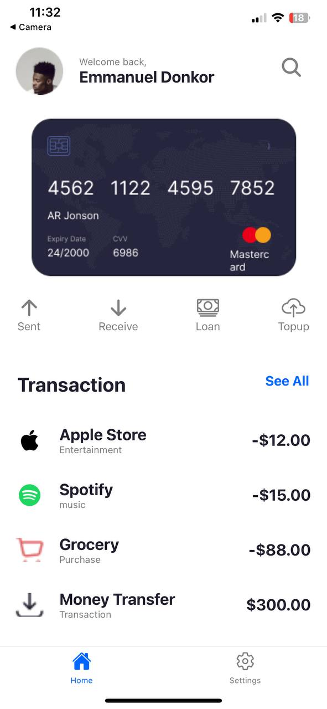
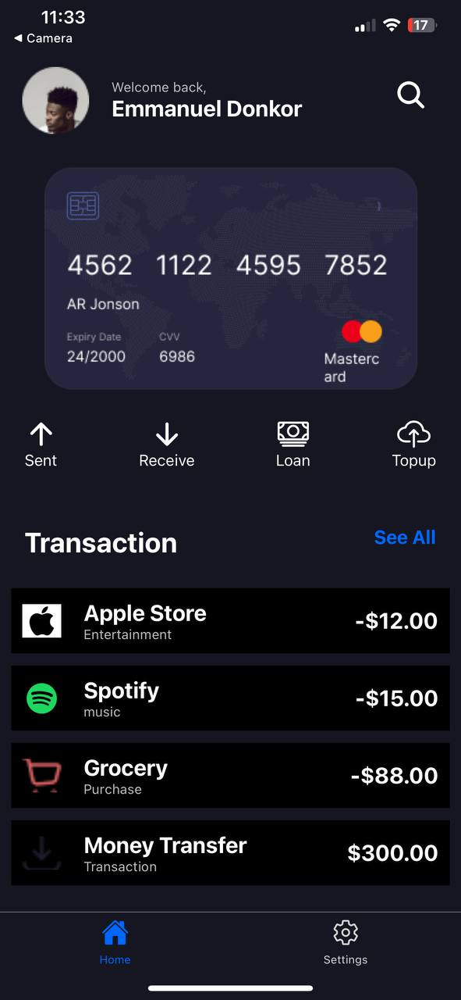
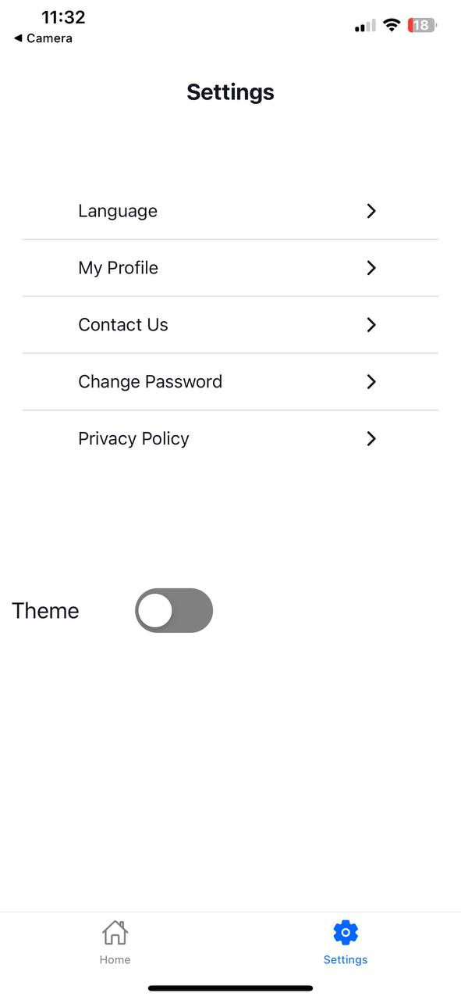
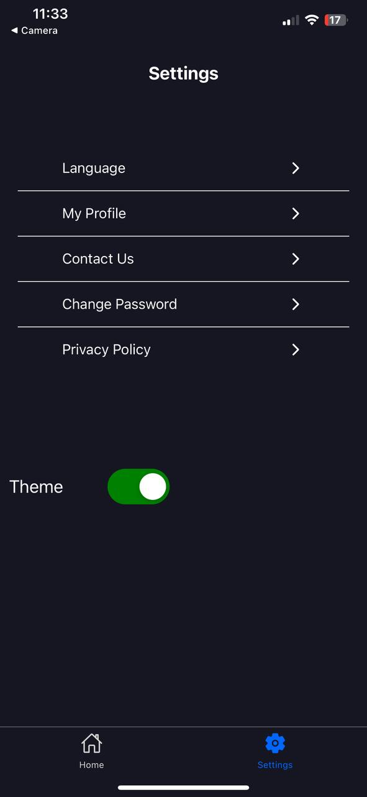

# Dark Mode Toggle Expo App

This is a simple Expo app demonstrating the implementation of a dark mode toggle. The app includes a home screen with transaction details and a settings screen where users can switch between light and dark modes.

## Features

- Dark mode toggle across the app.
- Bottom tab navigation with Home and Settings screens.
- Dynamic status bar styling based on the selected theme.
- Reusable components and context for managing the dark mode state.

## Installation

To get started with the app, follow these steps:

1. Clone the repository:

   ```bash
   git clone https://github.com/your-username/dark-mode-toggle-app.git
   ```

2. Navigate to the project directory:

   ```bash
   cd dark-mode-toggle-app
   ```

3. Install the dependencies:

   ```bash
   npm install
   ```

4. Start the app:
   ```bash
   npm start
   ```
   This will open the Expo Developer Tools in your browser. You can then run the app on an emulator, simulator, or physical device using the Expo Go app.

## Project Structure

The app is built using the following structure:

- **App.js**: The main entry point of the application. It includes the `DarkModeProvider` for managing the dark mode state, the `NavigationContainer` for navigation, and the `StatusBarManager` for dynamic status bar styling.
- **DarkModeContext.js**: Contains the context and provider for managing the dark mode state.
- **Home.js**: The home screen component displaying user information and transaction details.
- **Settings.js**: The settings screen component allowing users to navigate to different settings options and toggle the dark mode.
- **NavTabs.js**: The bottom tab navigator configuration.
- **assets/**: Contains images used in the app (profile picture, card, transaction icons).

## Screenshots

### Home Screen - Light Mode



### Home Screen - Dark Mode



### Settings Screen - Light Mode



### Settings Screen - Dark Mode


